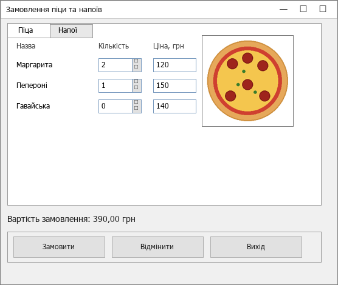

# Практичне заняття 2. Контейнери елементів Windows Forms — Варіант 1

> 🔴 **Жива демонстрація форми (GitHub Pages):** https://tonybuynistrovich-cell.github.io/praktychne2-winforms/


**Тема:** використання контейнерів елементів керування.
**Завдання (Варіант 1):** форма замовлення піци та напоїв.

Студентка: Осипенко Антоніна Вікторівна, гр. зІ-41.

## Що реалізовано

- **`TabControl` з двома вкладками:**
  - **Піца** — 3 сорти (Маргарита, Пепероні, Гавайська): `Label` (назва),
    `NumericUpDown` (кількість порцій), `TextBox` (вартість порції) + `PictureBox`
    із зображенням піци.
  - **Напої** — 3 позиції (Сік, Кава, Чай): такі самі елементи.
- **`FlowLayoutPanel`** з кнопками **Замовити**, **Відмінити**, **Вихід**.
- Логіка кнопок:
  - **Замовити** — обчислює загальну вартість замовлення (Σ кількість × ціна) по
    обох вкладках і показує її у написі та у вікні повідомлення;
  - **Відмінити** — очищає всі `NumericUpDown` (кількість = 0);
  - **Вихід** — закриває форму.

## Скріншот



## Як запустити

Потрібен Visual Studio 2022 (Windows) або .NET SDK 6.0+/8.0.

```bash
dotnet run --project PracticeWork2.csproj
```

> Запускається **лише на Windows** (Windows Forms). Зображення `pizza.png`
> автоматично копіюється у теку збірки, звідки його завантажує `PictureBox`.

## Файли

```
PracticeWork2/
├── Program.cs            — точка входу
├── MainForm.cs           — форма (TabControl, FlowLayoutPanel, логіка кнопок)
├── PracticeWork2.csproj  — проєкт (net8.0-windows, WinForms)
├── pizza.png             — зображення для PictureBox
└── pizza_form.png        — скріншот форми (для звіту)
```

## Примітка про оформлення

Інтерфейс побудований у коді (у конструкторі форми) — це робить проєкт
самодостатнім і повністю відтворюваним. Якщо за вимогами треба зробити форму
через візуальний конструктор Visual Studio (перетягуванням елементів), ту саму
розкладку легко відтворити: додати `TabControl` з 2 вкладками, на кожну —
`Label`/`NumericUpDown`/`TextBox`, `PictureBox` на вкладку «Піца», унизу —
`FlowLayoutPanel` з трьома кнопками, і прив'язати їхні обробники `Click`.
